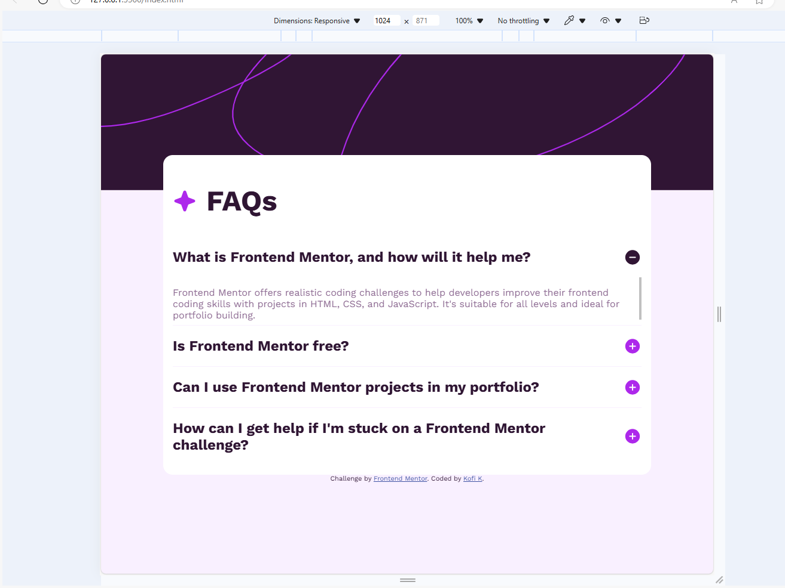

# Frontend Mentor - FAQ accordion solution

This is a solution to the [FAQ accordion challenge on Frontend Mentor](https://www.frontendmentor.io/challenges/faq-accordion-wyfFdeBwBz). Frontend Mentor challenges help you improve your coding skills by building realistic projects. 

## Table of contents

- [Overview](#overview)
  - [The challenge](#the-challenge)
  - [Screenshot](#screenshot)
  - [Links](#links)
- [My process](#my-process)
  - [Built with](#built-with)
  - [What I learned](#what-i-learned)
  - [Continued development](#continued-development)
  - [Useful resources](#useful-resources)
- [Author](#author)
- [Acknowledgments](#acknowledgments)

**Note: Delete this note and update the table of contents based on what sections you keep.**

## Overview

### The challenge

Users should be able to:

- Hide/Show the answer to a question when the question is clicked
- Navigate the questions and hide/show answers using keyboard navigation alone
- View the optimal layout for the interface depending on their device's screen size
- See hover and focus states for all interactive elements on the page

### Screenshot


Desktop Mode


Mobile Mode



Active State of Accordion

### Links

- Solution URL: [Add solution URL here](https://your-solution-url.com)
- Live Site URL: [Add live site URL here](https://your-live-site-url.com)

## My process

### Built with

- Semantic HTML5 markup
- CSS custom properties
- Flexbox
- CSS Grid
- JavaScript


### What I learned

This project helped revise on using css,html stuff I learnt about (flex,grid,BEM naming convection etc.) and also gave me an opportunity to study a bit of JavaScript


These are some code snippets I was able to write:

```js
<script>
  var list=document.querySelectorAll(".card__content__list");

  for (j=0;j<list.length;j++){
    list[j].addEventListener("click",function toggle() {
        this.classList.toggle("active");
        
    })

};
</script>
// this code was meant to find elements with  class "card__content__list"
// and connect them all to a function through an EventListener using a loop
// in order to add and remove the class "active" from them.
```
```css

/* text in  .card__content__list__text get hidden at the beginning of the webpage*/
.card__content__list__text{
    /* display: none; */
    height: 0;
    /* max-height: 0; */
    overflow: hidden;
    transition: all 0.3s;
}
/* and gets revealed by changing its height to 16*5 px when its  .*/
/* parent container .card__content__list gets the  .active class toggled in it. */
.card__content__list.active .card__content__list__text{
    /* display: flex; */
    /* height:auto; */
    height: 5rem;
    overflow: scroll;
}
/* when the parent container gets active,the img meant to represent the list */
/* would be turned to a minus sign. */
.card__content__list.active .card__content__list__title img{
    content:url("assets/images/icon-minus.svg");
    /* used to change image sources for examples. */
    /* border: thin solid #000; */
}

/* this changes the cursor to a hand -pointing cursor(often used for links.) */
.active, .card__content__list__title:hover {
    /* background-color: var(--Light-pink); */
    cursor:pointer;
  }

  
```


### Continued development

From this project, I think I want to learn more about JavaScript and toggling classes since

that is what I mostly suffered with.

### Useful resources

- [A video that helped me out](https://www.youtube.com/watch?v=4qnWreynXLU) - This helped me to understand how to connect elements with a certain class and assign certain CSS properties 
to them using a custom class.


## Author
- Kofi K
- Website - [GitHub](https://github.com/Kofi100)
- Frontend Mentor - [@Kofi100](https://www.frontendmentor.io/profile/Kofi100)


<!-- ## Acknowledgments

This is where you can give a hat tip to anyone who helped you out on this project. Perhaps you worked in a team or got some inspiration from someone else's solution. This is the perfect place to give them some credit.

**Note: Delete this note and edit this section's content as necessary. If you completed this challenge by yourself, feel free to delete this section entirely.** -->
